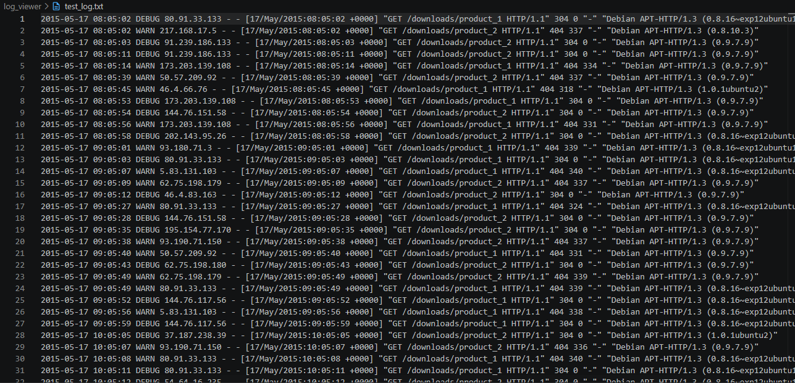
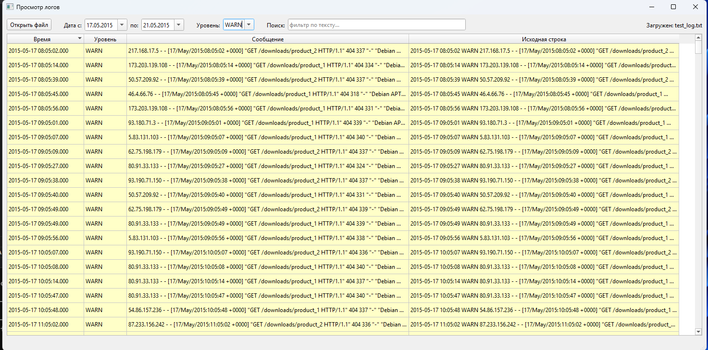

# Log Viewer

Утилита для просмотра и фильтрации логов с PyQt6 интерфейсом.





## Возможности

- **Загрузка логов** — открытие файлов `.log`, `.txt`
- **Автоопределение формата** — ISO, Apache combined, syslog, generic timestamp
- **Динамические фильтры** — даты и уровни логирования извлекаются из содержимого файла
- **Фильтр по тексту** — поиск подстроки (без учёта регистра)
- **Группировка дубликатов** — показ повторяющихся строк с счётчиком
- **Подсветка по уровню** — ERROR (красный), WARN (жёлтый), DEBUG (синий)
- **Растягивание колонок** — сообщение занимает всё свободное пространство

## Формат логов

Парсер поддерживает форматы:

```
2024-01-15 10:30:45 INFO Message here
2024-01-15 10:30:45,123 ERROR Error message
[2024-01-15 10:30:45] [WARN] Warning message
Jan 15 10:30:45 hostname app: message
```

HTTP коды → уровни: `2xx` → INFO, `3xx` → DEBUG, `4xx` → WARN, `5xx` → ERROR

## Запуск

```bash
cd log_viewer
pip install -r requirements.txt
python log_viewer.py [path_to_log]
```

## Интерфейс

```
┌─────────────────────────────────────────────────────────────────────────┐
│ Просмотр логов                                                           │
├─────────────────────────────────────────────────────────────────────────┤
│ [Открыть файл]  Дата с: [15.05.2015 ▼] по: [21.05.2015 ▼]              │
│ Уровень: [Все       ▼]  Поиск: [____________]  ☐ Группировать дубликаты  │
├─────────────────────────────────────────────────────────────────────────┤
│  Время            │ Уровень │ Сообщение                                 │
│───────────────────┼─────────┼──────────────────────────────────────────│
│  2015-05-17 08:05 │ DEBUG   │ 80.91.33.133 - - [17/May/2015:08:05:02  │
│  2015-05-17 08:05 │ WARN    │ 217.168.17.5 - - [17/May/2015:08:05:02  │
│  2015-05-17 08:05 │ DEBUG   │ 91.239.186.133 - - [17/May/2015:08:05:03 │
├───────────────────┴─────────┴──────────────────────────────────────────┤
│ Показано 1000 из 1000 записей                                           │
└─────────────────────────────────────────────────────────────────────────┘
```

**С группировкой дубликатов:**

```
┌─────────────────────────────────────────────────────────────────────────┐
│  Кол-во │ Время            │ Уровень │ Сообщение                       │
│─────────┼───────────────────┼─────────┼─────────────────────────────────│
│  ×342   │ 2015-05-17 08:05 │ WARN    │ ... "GET /downloads/product_1   │
│  ×128   │ 2015-05-17 08:05 │ DEBUG   │ ... "GET /downloads/product_1   │
│  ×89    │ 2015-05-18 12:05 │ INFO    │ ... "GET /downloads/product_2   │
└─────────┴───────────────────┴─────────┴─────────────────────────────────┘
```

## Структура проекта

```
log_viewer/
├── log_viewer.py      # PyQt6 интерфейс
├── log_parser.py      # Парсер логов
├── requirements.txt   # PyQt6>=6.6.0
└── test_log.txt      # Тестовый файл (1000 записей, 5 дат)
```
